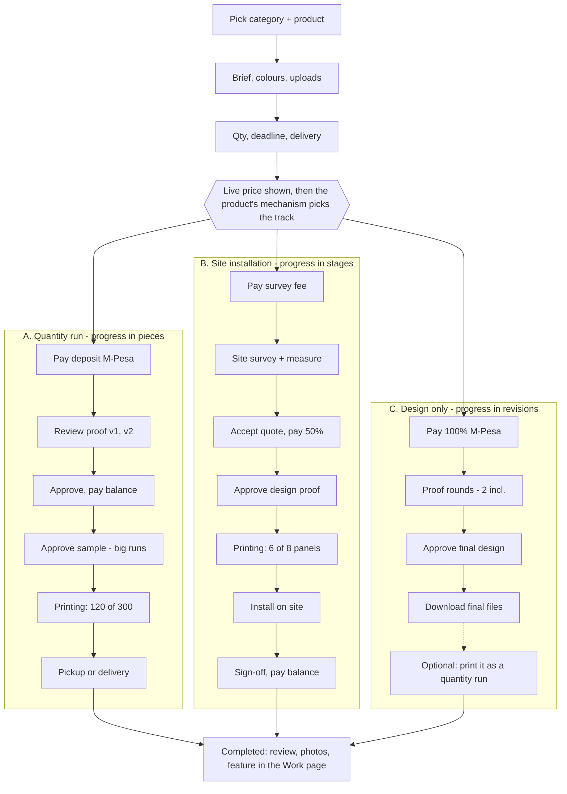
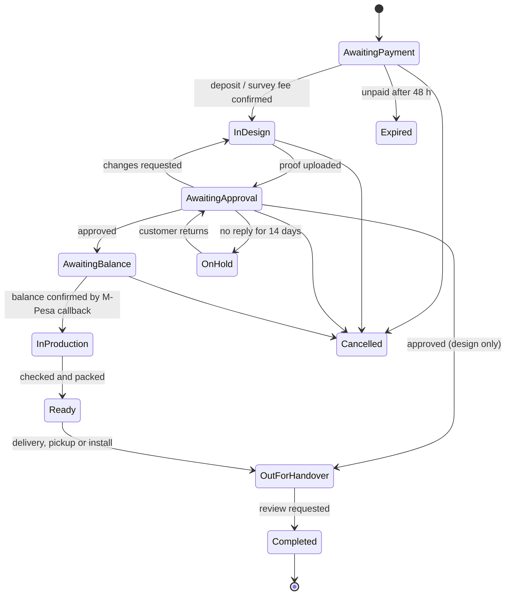

# Noorcom Branding: Order Workflow Spec

Last updated 7 Oct 2026.

> **For Claude Code:** read `docs/RUNBOOK.md` and `AGENTS.md` first, then this spec. This spec changes an existing owner decision (see "Fit with the current codebase"). Do not write payment or checkout code until `AGENTS.md` and the RUNBOOK decisions log have been updated to allow it. Follow the existing architecture rules: pages get data only through `api` from `@/lib/api`, new behaviour is added to the `SiteApi` interface and mocked first, and all checks (`lint`, `typecheck`, `test`, `build`, `a11y`, `devices`, `menu`) must pass before handover. All numbers marked as proposals are placeholders for Noorcom to confirm.

## Overview

The site moves from "send us a brief, we reply in a day" to a self-serve order flow: the customer picks a category, fills a brief built for that category, picks a deadline tier, pays a deposit by M-Pesa, approves a mock design, then tracks production until delivery or pickup.

**Where the live site stands today.** The Next.js site already has the seven service categories (indoor, outdoor, vehicle, apparel, corporate gifts, stationery and print, large-format), a Shop with per-piece prices and minimums (business cards KES 18, mugs KES 450, bottles KES 800, A4 notebooks KES 1,200, all min. 50), and a 3-step quote form (The job, Artwork and timing, Your details). The new flow extends that form rather than replacing it.

**The key design decision:** every order runs on one of three mechanisms, and the mechanism decides the form, the price formula, the progress tracker and the fulfilment options.

| Mechanism | What the customer buys | Progress is measured in | Ends with |
| --- | --- | --- | --- |
| A. Quantity run | N identical pieces (books, tees, mugs, cards, posters) | Pieces done out of N | Delivery or pickup |
| B. Site installation | A space or object branded (office, shop front, vehicle, billboard) | Stages done (survey, print, install) | Installation on site + sign-off |
| C. Design only | A digital file (poster, logo, social post, artwork) | Revision rounds + delivery | Download link |

Many orders mix two: "design my poster and print 200" is C then A on the same order.

## Fit with the current codebase

The repo (Next.js 16, TypeScript strict, Tailwind v4, Vitest) already has most of the front half of this workflow; the order system slots in behind the existing `SiteApi` interface rather than beside it.

**Decisions this workflow changes (signed off 5 and 6 Oct 2026)**

- The decisions log (3 Oct 2026) said the shop is add-to-quote only, with no cart, payment or M-Pesa, and `AGENTS.md` said never add a cart or checkout. This spec adds M-Pesa payment; the owner approved it on 5 Oct 2026 and `AGENTS.md` and the decisions log were updated.
- The RUNBOOK kept the backend and back office as a separate project, built later. The order system is that backend; the staff dashboard in this spec is the back office. Both now live in this repo (`backend/`, later `admin/`; owner, 6 Oct 2026; see `docs/BACKEND_RUNBOOK.md`).

**What already exists and gets reused**

| Existing piece | Where | Becomes |
| --- | --- | --- |
| 3-step quote form with per-step checks | `components/quote/QuoteForm.tsx` | The order brief, with the category-specific fields added to step 1 |
| Quote rules, `coerceDraft`, Kenyan phone normalisation | `src/lib/quote.ts` | Order rules; the server still re-checks everything |
| Server action that re-validates | `src/app/quote/actions.ts` | `createOrder` action, then the payment step |
| Deadline, collect / deliver / install, location | Quote step 2 | Turnaround tier picker + fulfilment choice |
| Artwork upload (5 files, 25 MB each) | Quote step 2 | Real uploads to object storage (today only file names travel) |
| Quote list in localStorage | `src/lib/quote-list.ts`, `useQuoteList` | The cart for shop items, now payable |
| `NB-` + 6 digit reference | Quote confirmation | The order number, used as the M-Pesa account reference |
| Per-piece prices, minimum 50 | `src/lib/api/data/products.ts` | Base unit price; quantity tiers added on top |
| Redirects `/checkout`, `/order-confirmation` to `/quote` | `next.config.ts` | Point `/order-confirmation` at the new order tracker |

**How the new pieces plug in**

- New `SiteApi` methods in `src/lib/api/types.ts`, mocked first like the rest: `priceEstimate`, `createOrder`, `startPayment`, `getOrder`, `approveProof`, `requestChanges`, `bookSurvey`. Pages keep importing only `api` from `@/lib/api`.
- New routes: `/order/[ref]` (tracker, proofs, payments), `/account` (orders, brand kit). The staff dashboard stays out of the public site, as the RUNBOOK already decided.
- M-Pesa callbacks need a public HTTPS URL. They belong in the backend, not in the Vercel preview; production is the VPS (port 4301 for the site, nginx in `deploy/`).
- Keep the house rules: no people in any photo, so proof mockups show products and walls only; no registration (crosshair) marks; colour tokens from `globals.css`; all checks pass before handover.

## Order mechanisms

Each product in the catalogue carries a `mechanism` field (A, B or C). The system reads it to pick everything downstream, so staff never have to classify an order by hand.

**A. Quantity run** (apparel, corporate gifts, stationery, books, posters, banners, stickers)

- Priced per piece with quantity tiers and a minimum order.
- Production is logged in batches: staff enter "120 printed" and the tracker updates to 120 / 300.
- Before the full run, a **pre-production sample** (one piece) can be photographed and approved, for runs over a threshold such as 200 pieces.
- Partial deliveries are possible if the customer wants the first 100 early.

**B. Site installation** (indoor branding, outdoor branding, vehicle branding, billboards)

- Cannot be priced instantly because it depends on the site. Price comes from a **site survey** (measurements, wall type, access, permits).
- The customer pays a **survey fee** online (credited to the final bill), books a survey slot, then receives a firm quote.
- Progress is tracked by stage, not pieces: Survey done, Design approved, Materials printed (for example 6 of 8 panels), Installation scheduled, Installed, Signed off.
- Ends with on-site installation and a customer sign-off (photo + signature on the staff app).
- Outdoor signage may need county permits; the flow tracks that as a stage.

**C. Design only** (posters, logos, flyers, social media artwork, menus)

- Fixed package prices (for example Poster design, Logo package) plus a rush fee.
- Includes a set number of revision rounds; extra rounds are billed.
- Delivered as files (PDF, PNG, source files if the package includes them) through a download link in the order page.
- Can convert into a Mechanism A order with one click: "Print this design", carrying the approved artwork straight into a quantity run.

## Customer journey



The first three steps are the same for everyone; after the live price, the product's mechanism sends the order down one track. Printing only starts after the proof is approved and paid for, on every track.

## Brief forms by category

Every order shares one **common brief block**, then adds fields specific to its category. The form is built from a JSON schema per product, so adding a new product never needs new code.

**Common brief block (all orders)**

- Brand colours: colour pickers plus HEX / Pantone text fields, up to 5 colours.
- Typography: font names, or "use what's in my logo", or "let the designer choose".
- Logo and assets upload: PDF, AI, EPS, SVG, PSD, CDR, PNG, JPG, TIFF, ZIP (up to 5 files of 25 MB, as the current form allows).
- Inspiration images: up to 5 uploads plus links (Pinterest, Instagram, websites).
- Text content: exact wording to appear (names, slogans, phone numbers).
- Style tags: Minimal, Bold, Corporate, Playful, Luxury, Traditional (multi-select).
- Artwork status: "I have print-ready artwork" (skips design fee, goes to file check) or "I need it designed".
- Notes: free text, 2,000 characters (as on the current form).

**Category-specific fields**

| Category | Mechanism | Extra fields |
| --- | --- | --- |
| Apparel (tees, hoodies, caps, uniforms) | A | Garment type and colour, size breakdown (S/M/L/XL/XXL quantities that sum to the total), print positions (front, back, sleeve, chest), method (screen, heat transfer, embroidery), number of print colours |
| Corporate gifts (mugs, bottles, umbrellas, bags) | A | Item and variant, item colour, print area (one side / wrap), branding method (print, engraving, embroidery), gift packaging yes/no |
| Stationery (cards, letterheads, envelopes) | A | Size, paper weight (gsm), finish (matte, gloss, spot UV, foil), single or double sided, for cards the number of names and the details per name |
| Books and booklets | A | Page count, page size, inner paper gsm, cover type (soft, hard), binding (saddle stitch, perfect bound, spiral), colour or black-and-white inner pages, number of copies, print-ready PDF upload |
| Posters, flyers, brochures | A | Size (A5 to A0), paper and finish, folding for brochures, quantity |
| Large-format (banners, roll-ups, backdrops, stickers) | A | Width x height in cm, material (vinyl, PVC, canvas, mesh), stand or eyelets, indoor or outdoor use |
| Indoor branding | B | Site address and pin, space type (reception, office, shop, event), surfaces (wall, glass, floor), approximate area in m2 or photos of the space, preferred survey dates |
| Outdoor branding | B | Site address and pin, sign type (shop front, pylon, light box, billboard), approximate size, mounting surface, lit or unlit, whether a county permit is in place |
| Vehicle branding | B | Make, model and year, number of vehicles, full / partial / door decals only, photos of each side, where vehicles are parked for install |
| Design only | C | Design type (poster, logo, flyer, social pack, menu), dimensions or platform, number of concepts wanted, file formats needed |

The size breakdown for apparel and the names list for business cards should accept a CSV upload too, since corporate orders often come as spreadsheets.

## Pricing

Mechanisms A and C get an instant price on screen; Mechanism B gets an instant survey fee and a firm price after the survey. All multipliers and percentages below are proposals for Noorcom to confirm.

**Price formula (A and C)**

```
Total = (unit_price[tier] x qty + setup + design_fee + options) x urgency_multiplier + fulfilment_fee
```

- **Unit price by quantity tier:** cheaper per piece as quantity grows, for example business cards KES 18 at 50 to 499, KES 15 at 500 to 999, KES 12 at 1,000+.
- **Setup:** one-off costs such as screen-making for screen printing or plates for offset, charged once per design and colour.
- **Design fee:** zero if the customer uploads print-ready artwork.
- **Options:** finishes, extra print positions, gift packaging.

**Turnaround tiers (the customer picks the deadline)**

Each product has a standard lead time set by staff (for example 5 working days for 300 tees). The customer picks a tier and sees the delivery date and price change live.

| Tier | Lead time | Multiplier | Note |
| --- | --- | --- | --- |
| Economy | Standard + 50% or more | 0.95 | Small discount for flexible deadlines |
| Standard | Standard lead time | 1.00 | Default |
| Express | About 50% of standard | 1.25 | Subject to capacity |
| Rush | Next working day or a set date | 1.50 | Only shown if capacity allows; staff confirm within 1 hour |

The date picker should also block dates the workshop cannot hit, using a simple **capacity calendar** (pieces or jobs per day per machine). That stops the site selling a rush job the printers cannot deliver.

**Fulfilment fees**

- Pickup at Chuka Elimu Plaza, Loita Street: free.
- Delivery within Nairobi: flat fee by zone (CBD, inner, outer).
- Countrywide: courier fee by county or by weight, quoted at checkout.
- Installation (Mechanism B): included in the survey-based quote.

**Payment terms**

| Mechanism | Pay at order | Pay later |
| --- | --- | --- |
| A. Quantity run | 50% deposit (or 100% under a threshold, e.g. KES 5,000) | Balance after proof approval, before printing starts |
| B. Site installation | Survey fee (credited to final bill) | 50% on quote acceptance, 50% on sign-off (or as agreed for corporates) |
| C. Design only | 100% upfront | Extra revision rounds |

Collecting the balance **before printing** is the protection against unpaid printed stock: printing only starts once the proof is approved and the balance is paid.

## Payments (M-Pesa)

Use the Absa STK Push and C2B APIs that Noorcom Network is already onboarding for Noorcom Branding, with Safaricom Daraja as the fallback if that onboarding stalls. Every payment is tied to an order through the order number used as the account reference.

**Two ways to pay, both on the checkout page**

1. **STK Push (default):** customer enters their phone number, taps Pay, gets the M-Pesa PIN prompt on their phone. The page waits on a "Check your phone" screen and updates when the callback arrives.
2. **Manual Paybill (fallback):** shows the Paybill number and the order number as the account number. The C2B confirmation callback matches the payment to the order automatically.

**Payment events per order**

- Deposit (or full payment) at checkout.
- Balance after proof approval, requested by an STK prompt plus a link on WhatsApp and by email.
- Rush upgrade or extra revisions mid-order.
- Delivery fee if the customer switches from pickup to delivery later.

**Rules the backend must enforce**

- Store every request and callback in a `payments` table with the M-Pesa receipt number; the receipt number is unique, so a repeated callback can never credit twice.
- An order only moves forward on a **confirmed callback**, never on the browser saying "paid".
- STK timeout (no PIN within about 60 seconds) or a cancel: show "Try again" and the Paybill fallback; keep the order in Awaiting payment.
- Underpayment via Paybill: record it, show the outstanding balance, do not advance the order.
- Overpayment: record it as credit on the customer account or flag for refund.
- Unpaid orders auto-expire after 48 hours (configurable) and release the capacity slot.
- Corporate clients (LPO / invoice terms) can be marked by staff to skip upfront payment.
- Generate a receipt PDF and an invoice per payment, and an eTIMS-compliant invoice if Noorcom is VAT-registered (open question).

## Proofs and approval

Nothing is printed until the customer clicks Approve on a specific proof version; that click is the legal and practical gate of the whole workflow.

**How a proof is shown**

- The designer uploads a proof (PDF or images) on the staff dashboard; the customer gets the link on WhatsApp and by email.
- The proof page shows the design on a **mockup** of the real item (tee, mug, van, office wall) next to the flat artwork, watermarked "PROOF" so it cannot be used without paying.
- The customer can pin comments directly on the image ("make the logo bigger here") instead of writing long messages.
- Every version is kept (v1, v2, v3) so both sides can compare.

**Customer actions on a proof**

1. **Approve:** confirms spelling, colours, size and quantity in a checklist, ticks "I understand printed colours may vary slightly from screen", then approves. This locks the artwork and triggers the balance payment.
2. **Request changes:** pinned comments + notes; uses one revision round.
3. **Ask a question:** chat with the designer without using a round.

**Revision rules (proposal)**

- 2 revision rounds included for designed work, 1 for customer-supplied artwork (file fixes only).
- Extra rounds billed at a flat fee, paid by STK before the designer starts.
- Proofs not answered in 5 working days get reminders; after 14 days the order pauses and the deadline is recalculated.

**Pre-production sample (Mechanism A, large runs)**

After digital approval, staff print one piece and upload a photo. The customer approves the sample before the full run. Optional for small runs, recommended above about 200 pieces or for expensive items.

**Deadline starts at approval**

The promised completion date counts from proof approval and balance payment, not from the order date. The order page states this clearly so customers understand that slow approvals move the date.

## Order statuses and tracking



One status list serves all three mechanisms; what changes is how the In production step is measured. Three side statuses sit outside the main flow: **Expired** (unpaid after 48 hours), **On hold** (no reply to a proof for 14 days, deadline recalculated on return) and **Cancelled** (allowed any time before production, refund rules apply). Design-only orders skip Awaiting balance and go from approval straight to Out for handover as a download.

**What the customer sees on the tracker**

| Element | Quantity run (A) | Site installation (B) | Design only (C) |
| --- | --- | --- | --- |
| Progress bar | Pieces: 120 of 300 (40%) | Stages: 4 of 7 | Round 2 of 2 |
| Detail line | 180 left, finishing tomorrow | 6 of 8 panels printed, install booked Thursday | Revised proof due tomorrow 3 pm |
| Proof of work | Batch photos from the floor | Photos per stage, before and after on site | Each proof version |
| Deadline | Promised date + on track or at risk badge | Survey date + install date | Delivery date for final files |
| Actions | Approve proof, pay balance, ask for partial delivery, switch to delivery | Book survey, accept quote, confirm install date, sign off | Approve, request changes, buy extra round, print this design |

**The ETA line is calculated, not typed.** The system takes the pieces still to print, divides by the product's daily capacity (or the recent rate from the production logs), and shows the finish date. If that date passes the promised deadline, the order is flagged at risk for staff before the customer notices.

## Fulfilment

The customer chooses how they receive the work at checkout and can change it until the order reaches Ready; changing to delivery adds the fee as a new payment.

| Route | Mechanisms | How it works | Proof of handover |
| --- | --- | --- | --- |
| Pickup at the shop | A | Order shows "Ready for pickup" with a 6-digit pickup code; staff enter the code at the counter | Code match + name of collector |
| Delivery (Nairobi or countrywide) | A | Rider or courier assigned; customer sees rider name, phone and a tracking or waybill number | Photo on delivery + recipient name, or courier waybill |
| Partial delivery | A | Customer can request finished batches early (e.g. first 100 of 300); each batch is its own delivery record | Same as delivery, per batch |
| On-site installation | B | Install date booked in the order page; installer team checks in on site | Before/after photos + customer sign-off on the staff app |
| Digital handover | C | Final files unlock in the order page after full payment; download link also emailed | Download logged |

After handover the order moves to Completed and the customer is asked for a review and permission to feature the job in the Work section of the site, which feeds the portfolio automatically.

## Accounts and notifications

Accounts are optional: anyone can order as a guest, and a guest order can be claimed into an account later with the same phone number.

**Guest checkout**

- Needs name, phone (for M-Pesa and WhatsApp) and email.
- Gets an order link with a secret token plus a one-time code on WhatsApp to open the tracker later. Lookup by order number + phone also works.

**Accounts**

- Sign in with email + a one-time code sent by email (decided 8 Oct 2026: free, where a WhatsApp code is charged per message; built on the site). The account is the verified email.
- Account page: all orders, saved brand kits, saved addresses, invoices and receipts, credit balance.
- **Brand kit:** logo files, colours and fonts saved once and auto-filled into every future brief. This is the main reason a repeat customer creates an account.
- **Reorder:** one click to repeat a past order with the same approved artwork, skipping design.
- **Company accounts:** several staff under one company, with one person approving proofs and payments, and optional invoice/LPO terms.

**Notifications**

| Event | WhatsApp | Email |
| --- | --- | --- |
| Order placed | Yes | Yes |
| Payment confirmed (after M-Pesa's own SMS receipt) | Yes | Yes, with receipt PDF |
| Proof ready / new version | Yes | Yes |
| Balance payment requested | Yes | Yes |
| Production milestones (25%, 50%, 100%) | Optional | Yes |
| Ready for pickup / out for delivery / install date | Yes | Yes |
| Deadline at risk (staff flag) | Yes | Yes |
| Completed + review request | Optional | Yes |

Noorcom sends on WhatsApp and email only, never SMS. The one SMS a customer gets is Safaricom's own M-Pesa message after paying; Noorcom's confirmation follows on WhatsApp and email once the callback lands.

All contact, including Contact us, runs through the existing number +254 722 530 301, which is on WhatsApp and also takes calls. Automated order messages need the WhatsApp Business Platform (Cloud API) with Meta-approved message templates. Check that this number can run on the API alongside the WhatsApp Business app (Meta's coexistence option), so staff keep chatting and taking calls on it; if not, automated messages would need a second number.

## Staff dashboard

The customer tracker is only as accurate as what staff log, so the staff side must make logging take seconds, ideally from a phone on the workshop floor.

**Roles**

Two roles (owner, 8 Oct 2026): the shop is the admin and the graphic designers, and the designers do every other job.

| Role | Can do |
| --- | --- |
| Admin | Everything: prices, tiers, capacity, refunds, staff accounts, reports and customer accounts |
| Designer | Everything on an order: review new orders, briefs and proofs, log production, handle pickups, deliveries and unmatched payments |

**Core screens**

- **Order board:** Kanban by status (New, In design, Awaiting approval, In production, Ready, Out, Done), filterable by category, deadline and mechanism, with overdue orders in red.
- **Production logger:** open an order, type "+120" or scan a job card QR code, optionally attach a photo. The tracker and ETA update instantly.
- **Capacity calendar:** jobs and pieces booked per day per machine (screen press, DTF/heat press, embroidery, offset, wide-format), which drives what deadlines the site offers.
- **Quote builder (Mechanism B):** enter survey measurements and materials, generate the firm quote the customer accepts online.
- **Price manager:** unit prices, quantity tiers, setup costs, urgency multipliers, delivery zones.
- **Reports:** revenue by category, on-time rate, average approval time, outstanding balances.

**Job card:** each order prints a one-page job card with a QR code, so production staff scan it instead of searching. Walk-in customers at the shop get entered through the same order form by front desk staff, so every job lives in one system.

## Data model and API

The model separates the **product** (what can be ordered and how it is priced) from the **order item** (what this customer ordered), so one order can hold a design-only item and a print run together.

**Core tables**

| Table | Key fields |
| --- | --- |
| `categories` | id, name, slug, sort_order |
| `products` | id, category_id, name, mechanism (A/B/C), brief_schema (JSON), min_qty, standard_lead_days, setup_fee, active |
| `price_tiers` | product_id, min_qty, max_qty, unit_price |
| `urgency_tiers` | code, label, lead_factor, multiplier |
| `customers` | id, name, phone, email, company_id, credit_balance |
| `brand_kits` | customer_id, colours (JSON), fonts, logo_file_ids |
| `orders` | id, order_no, customer_id, status, urgency_tier, fulfilment_method, address, promised_date, subtotal, fees, total, amount_paid |
| `order_items` | order_id, product_id, mechanism, quantity, brief (JSON answers), status, qty_completed |
| `files` | id, owner (order_item / proof / brand_kit), kind (logo, inspo, artwork, proof, final, photo), url, size |
| `proofs` | order_item_id, version, file_ids, status (pending, approved, changes_requested), approved_at, approved_by |
| `proof_comments` | proof_id, author, x, y, text |
| `production_logs` | order_item_id, qty_added, stage, photo_id, staff_id, created_at |
| `stages` | order_item_id, name, status, done_at (Mechanism B stages) |
| `payments` | order_id, purpose (deposit, balance, rush, extra_revision, delivery), method (stk, paybill), phone, amount, mpesa_receipt (unique), status, raw_callback |
| `deliveries` | order_id, method, batch_qty, rider/courier, waybill, pickup_code, handed_over_at, proof_photo_id |
| `capacity` | machine, date, capacity_units, booked_units |
| `notifications` | customer_id, channel (whatsapp, email), template, sent_at, status |

**Main API endpoints (backend)**

| Method | Endpoint | Purpose |
| --- | --- | --- |
| GET | /api/catalogue | Categories, products, brief schemas, price tiers |
| POST | /api/quotes/price | Live price for brief + qty + urgency + fulfilment |
| GET | /api/capacity?product&qty | Earliest available date per urgency tier |
| POST | /api/orders | Create order (guest or signed in) |
| POST | /api/uploads | Signed upload URL for logos, inspo, artwork |
| POST | /api/payments/stk | Start STK Push for a given order and purpose |
| POST | /api/payments/callback | STK callback (Absa or Daraja), idempotent on receipt |
| POST | /api/payments/c2b/confirm | Paybill confirmation, matched by account reference |
| GET | /api/orders/:no | Tracker data (status, progress, proofs, payments) |
| POST | /api/proofs/:id/approve | Approve a proof version |
| POST | /api/proofs/:id/changes | Request changes with pinned comments |
| POST | /api/staff/orders/:no/progress | Log pieces or a stage (staff only) |

Files should go to object storage (S3, Cloudflare R2 or similar) rather than the database, with signed URLs so proofs and customer logos are never public.

In this repo these endpoints belong to the separate backend; the Next.js site never calls them directly but through the new `SiteApi` methods, so the mock can stand in until the backend is ready.

## Additions, open questions and build phases

**Things worth adding that were not in the original ask**

- **Artwork file check:** when a customer uploads "print-ready" files, run an automatic check (resolution under 150 dpi, RGB instead of CMYK, missing bleed) and warn before they pay.
- **Cancellations and refunds:** free cancel before design starts; design fee kept after the first proof; no refund once printing starts. Must be in the Terms page.
- **Spoilage allowance:** printers usually run a few extra pieces; decide whether the customer gets them or whether shortfalls are reprinted at Noorcom's cost.
- **Quality issue / reprint request:** a "Report a problem" button on completed orders with photo upload, within 7 days.
- **Artwork ownership:** state who owns the design files and whether source files cost extra.
- **Shop items as a shortcut:** the existing Shop (fixed per-piece items) becomes the fast path into Mechanism A, pre-filling the brief.
- **Corporate re-orders and LPOs:** company accounts, invoice terms, and PO number on invoices.
- **Reviews and portfolio:** completed jobs (with permission) feed the Work page.

**Open questions for Noorcom**

- [x] Owner signs off on taking payment online (reverses the 3 Oct 2026 add-to-quote-only decision); then update `AGENTS.md` and the RUNBOOK decisions log. Done 5 Oct 2026.
- [ ] Confirm the deposit percentage and the threshold for paying in full.
- [ ] Confirm the urgency multipliers and which products can be rushed at all.
- [ ] Standard lead times per product and daily capacity per machine.
- [ ] Delivery zones and fees inside Nairobi, and the courier for upcountry.
- [ ] Survey fee for site jobs, and whether it is waived above a job size.
- [ ] Is Noorcom Branding VAT-registered (eTIMS invoices)?
- [ ] Will the Absa STK Push go live in time, or start on Daraja?
- [ ] Can +254 722 530 301 run on the WhatsApp Business Platform alongside the app (coexistence), or is a second number needed?
- [ ] How many revision rounds per design package.
**Build phases**

Status: all four phases built on the site (Phase 1 on 5 Oct 2026, Phases 2 to 4 on 6 Oct 2026), with payments, messages and sign-in codes mocked; see `docs/RUNBOOK.md`, "Online ordering". The staff back office (order board, production logging, proofs, unmatched payments, and the admin's reports and customer accounts with PDF and CSV downloads) is built in `admin/` (backend step B4, 8 Oct 2026), with the price manager for minimums and quantity tiers (deadline and delivery fees still in `shared/rules/pricing.js`). Customer accounts, brand kits, reorders, statements and company accounts run on the backend since 9 Oct 2026 (step B5, part 1); the sample, partial deliveries and site jobs are still mocked. See `docs/BACKEND_RUNBOOK.md`, section 13.

1. **Phase 1, core ordering:** category brief forms, live pricing with urgency tiers, guest checkout, STK Push + Paybill, order tracker with statuses, WhatsApp and email confirmations, staff order board.
2. **Phase 2, proofs and production:** proof upload and approval with pinned comments, balance payment gate, production logger with piece counts, pickup codes and delivery records.
3. **Phase 3, accounts and site jobs:** accounts with brand kits and reorder, Mechanism B survey booking and quote builder, installation scheduling and sign-off.
4. **Phase 4, polish:** capacity calendar driving dates, mockup previews, artwork file check, reports, company accounts.
